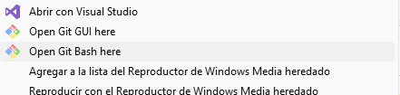

# Instructions

## [1] First Commit

1- Open git bash here

2- git init

3- git commit -m "first commit"

4- git remote add origin https://github.com/Cristian5888/[repository_name].git

5- git branch -M main

6- git push -u origin main

## [2] Updates

1- Open git bash

2- git status

3- git add .

4- git commit -m "second commit"

5- git push origin main
